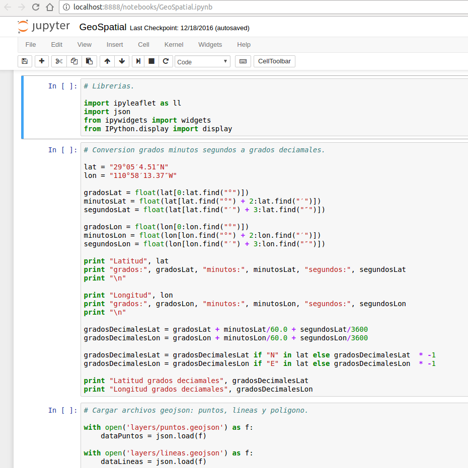

# GeoSpatial workshop

This is just a small workshop of how to display spatial data from 2 different source; GeoJSON files and ESRI Shapefile (SHP) file in a database.

# Jupyter Notebook

## Install Jupyter Notebook

First we need to install pip.

```
$ sudo apt-get install python-pip
$ pip install --upgrade pip
```

Before to install jupyter Notebook we are goint to create a virtualenv.

```
$ pip install virtualenv
$ virtualenv venv  
$ source venv/bin/activate
```
**NOTE:** to `deactivate` type `deactivate`.

Now we can to install Jupyter Notebook with pip.

```
$ pip install jupyter
```

To start Jupyter Notebook.

```
$ jupyter notebook
```

Once jupyter notebook is running, we just open `GeoSpatial.ipynb` file.



# Libraries we need to install

Ipyleaflet: A Jupyter / Leaflet bridge enabling interactive maps in the Jupyter notebook.

```
$ pip install ipyleaflet
$ jupyter nbextension enable --py --sys-prefix widgetsnbextension
$ jupyter nbextension enable --py --sys-prefix ipyleaflet
```

SQLAlchemy: is the Python SQL toolkit and Object Relational Mapper that gives application developers the full power and flexibility of SQL.

```
$ pip install sqlalchemy
```

Psycopg: Is the most popular PostgreSQL adapter for the Python programming language.

```
$ apt install libpq-dev python-dev
$ pip install psycopg2
```

GeoAlchemy2: Provides extensions to SQLAlchemy for working with spatial databases.

```
$ pip install geoalchemy2
```

# Install and setup PostgreSQL

To simplify just run the sh script file.

```
$ sudo su
$ ./install_setup_postgres.sh
```


